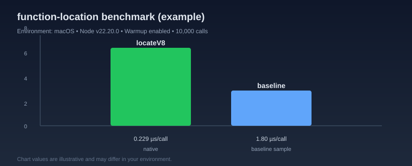

# function-location

`locateV8()` returns the absolute source file path for a function or class at runtime.

[](https://www.npmjs.com/package/function-location)
[](https://www.npmjs.com/package/function-location)
[](https://github.com/Nhahan/function-location/actions/workflows/ci.yml)

## Install

```bash
npm install function-location
```

Supports Node.js 8+ via N-API artifacts.

Current validation coverage includes Node.js 20/22/24 in CI; Node.js 8/10/12/14 support is a compatibility target and should be treated as a deployment target to verify before claiming fully guaranteed in production.

## Usage

```ts
import { locateV8 } from 'function-location';

class ExampleClass {}
function exampleFunction() {}

locateV8(ExampleClass);     // /path/to/file.ts
locateV8(exampleFunction);  // /path/to/file.ts
```

## API

- `locateV8(input: Function): string | undefined`
- Throws `Function argument expected` when input is not a function/class constructor.
- Returns `undefined` for anonymous/native/builtins where metadata is unavailable.

## Performance sample

This library uses a synchronous native addon lookup and does not use inspector protocol.

It is built with N-API so the same prebuilt strategy can run across Node.js 8+ runtimes while keeping installation simple.



Example output (warmup included), macOS + Node v22.20.0:

| Tool | Avg. time / call | Throughput | Calls |
| --- | ---: | ---: | ---: |
| `locateV8` | `0.0997 µs` | `~10,028,000 calls/sec` | `10,000` |

```text
locateV8             | ██
```

Re-run on your environment:

```bash
FUNCTION_LOCATION_NATIVE_ITERS=5000 npm run bench:compare
```

Optional comparison with another JS implementation:

```bash
npm i -D <baseline-module>
FUNCTION_LOCATION_BASELINE_MODULE=<baseline-module> FUNCTION_LOCATION_BASELINE_ITERS=300 npm run bench:compare
npm run bench:compare
```

Results vary by environment; treat them as sample measurements only.

## Distribution

- Prebuilt artifacts are generated in CI and distributed under `prebuilds/`.
- `node-gyp-build` loads the matching binary automatically.
- Artifacts are not committed in git history.
- For release policy and CI validation details, see [CONTRIBUTING.md](./CONTRIBUTING.md).

## Links

- [MIT License](https://github.com/Nhahan/function-location/blob/main/LICENSE)
