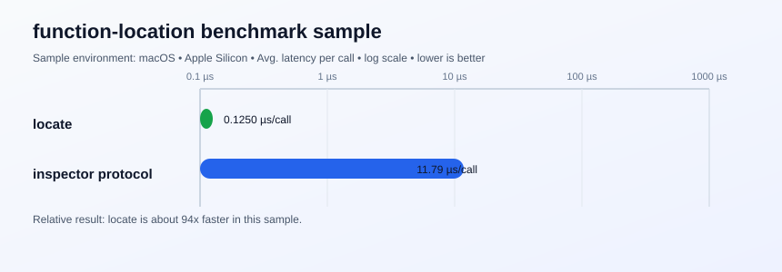

# function-location

`locate()` returns the absolute source file path for a function or class at runtime.

[](https://www.npmjs.com/package/function-location)
[](https://github.com/Nhahan/function-location/actions/workflows/ci.yml)

## Install

```bash
npm install function-location
```

## Supported runtimes

- Linux `x64`: Node.js `8+`
- Windows `x64`: Node.js `8+`
- macOS `x64`: Node.js `8+`
- macOS `arm64` native: Node.js `16+`

The package ships ABI-tagged native prebuilds inside the npm tarball and `node-gyp-build` selects the matching binary automatically.
Apple Silicon users running `x64` Node under Rosetta follow the macOS `x64` path.

## Usage

```ts
import { locate } from 'function-location';

class ExampleClass {}
function exampleFunction() {}

locate(ExampleClass);     // /path/to/file.ts
locate(exampleFunction);  // /path/to/file.ts
```

## API

- `locate(input: Function): string | undefined`
- Throws `Function argument expected` when input is not a function/class constructor.
- Returns `undefined` for anonymous/native/builtins where metadata is unavailable.

## Performance sample

This library uses a synchronous native addon lookup instead of the inspector protocol.

Sample run on macOS + Node `v22.20.0`, against an inspector-protocol baseline:

| Approach | Avg. time / call | Relative speed |
| --- | ---: | ---: |
| `locate` | `0.18 µs` | `289x faster` |
| `inspector protocol` | `50.92 µs` | `baseline` |



Results vary by environment; treat them as sample measurements only.

## Distribution

- Prebuilt artifacts are generated in CI and distributed under `prebuilds/`.
- `node-gyp-build` loads the matching binary automatically.
- Artifacts are not committed in git history.
- For release policy, support matrix validation, and CI details, see [CONTRIBUTING.md](./CONTRIBUTING.md).

## Links

- [MIT License](https://github.com/Nhahan/function-location/blob/main/LICENSE)
