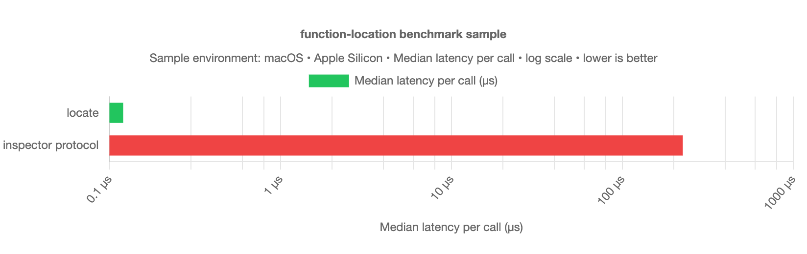

# function-location

`locate()` returns the absolute source file path for a function or class at runtime.

[](https://www.npmjs.com/package/function-location)
[](https://github.com/Nhahan/function-location/actions/workflows/ci.yml)

## Install

```bash
npm install function-location
```

Supports Node.js `16+`.

## Usage

```ts
import { locate } from 'function-location';

class ExampleClass {}
function exampleFunction() {}

locate(ExampleClass);     // /path/to/file.ts
locate(exampleFunction);  // /path/to/file.ts
```

## API

- `locate(input: Function): string | undefined`
- Throws `Function argument expected` when input is not a function/class constructor.
- Returns `undefined` for anonymous/native/builtins where metadata is unavailable.

## Performance sample

This library uses a synchronous native addon lookup instead of the inspector protocol.

Sample comparison against an inspector-protocol baseline:

| Approach | Median time / call | Relative speed |
| --- | ---: | ---: |
| `locate` | `0.1197 µs` | `1878.60x faster` |
| `inspector protocol` | `224.8900 µs` | `baseline` |



Results vary by environment; treat them as sample measurements only.
Methodology and raw samples: [docs/BENCHMARK.md](./docs/BENCHMARK.md)

## Links

- [Contributing / support matrix](./CONTRIBUTING.md)
- [MIT License](https://github.com/Nhahan/function-location/blob/main/LICENSE)
